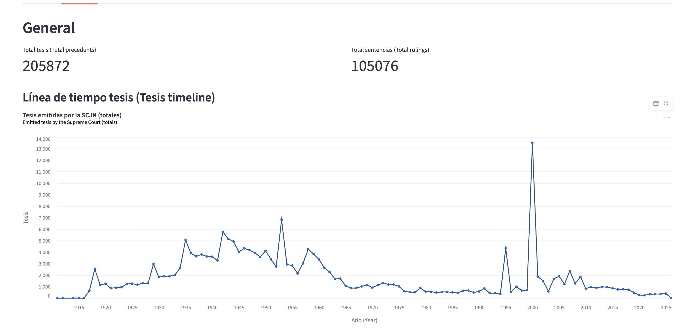
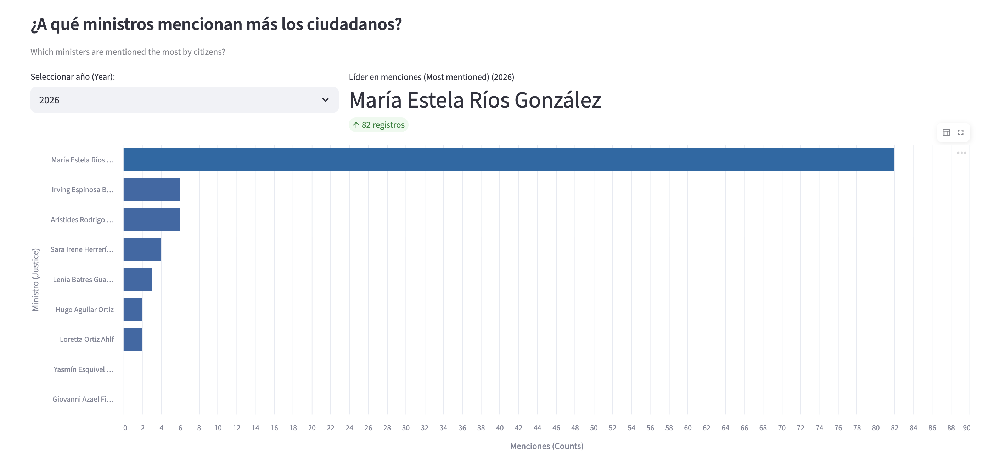
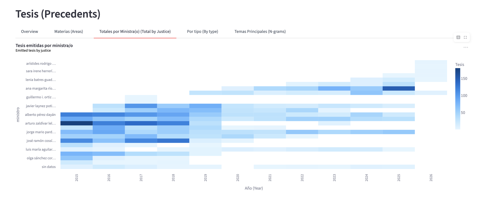
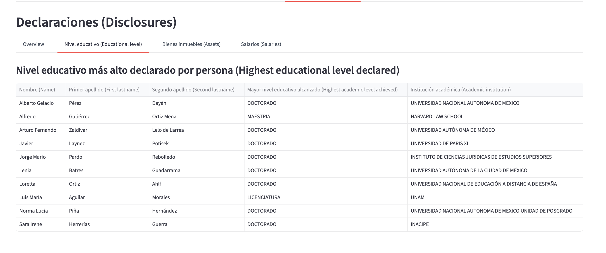

# Accountable Justice Lab 

## Members

- Jimena Gómez (<jimenagomez@uchicago.edu>)
- Daniela Avayu (<davayu@uchicago.edu>)
- Maria Fernanda Muñoz (<mfmunoz@uchicago.edu>)

## Objectives and Insights 

The application aims to provide insights into the performance and activity of the Supreme Court through two main perspectives.

First, it presents a general overview of the Court, highlighting key performance indicators and long-term trends. These include the volume and evolution of court rulings (sentencias), judicial precedents (tesis), and information requests between 2015 and 2026. This perspective focuses on identifying institutional patterns and changes over time.

Second, the application provides a justice-level analysis, allowing users to explore metrics associated with individual justices. For each justice, users can examine indicators such as transparency requests referencing them, asset declarations, and other available information. The analysis spans 2015 to the present, enabling comparisons across the approximately 15–20 justices that compose the Court.









Although the official name of our project is "Accountable Justice Lab", the name of our platform is "Ojo Piojo". This is a popular Chilean phrase that hints at being alert. We wanted a playful name because we believe the intersection of data analysis and social change needs an element of fun, creativity and playfulness - we believe this is how we find things out of the ordinary. 


**Link to project video:** <https://www.youtube.com/watch?v=Dxhgxxyba-0>.

## Repository structure

**1. Data: Divided into raw/ clean /visualization.** 

raw_data: Original files downloaded from external sources
clean_data: Processed datasets used for analysis
viz_dev: Intermediate files used for visualization development

**2. SRC**
Contains the actual source code of project and contains 4 four sub-folders. 
a) Extraction: Data is extracted from multiple sources. 
b) Cleaning_and_processing: Data is processed.
c) Analysis: Data processed used to the visualizations. 
d) App: The Streamlit application that powers the interactive dashboard.

**3. Tests:** Contains simple validation tests for the three main datasets.

**4. Exploratory:** exploratory files of the data that are not part of the running program. 


## How to run

**Requirements**:
* Python 3.13.7
* uv
* Streamlit

The repository has a Makefile that has included all necessary commands for the program to run. 

After cloning the repository, each step can be done sequentially to execute the dashboard or individually to access certain aspects of the process, such as data extraction and cleaning. 

```
git clone https://github.com/your-repository/project-accountable-justice-lab.git
cd project-accountable-justice-lab
make install
make fetch_data
make data_extraction
make clean_data
make analysis
make app
```

## Data sources

This project combines data from two primary sources.

### Repositorio de la Suprema Corte de Justicia de la Nación

#### 1. Sentencias (court rulings)

This is historical information of court rulings by Mexico's Supreme Court of Justice. 

#### Tesis (judicial criteria / precedents)
    
Both types of information had two different forms of accessing:
- Information pre August 2025: bulk data obtained directly from the Supreme Court (this data will be automatically downloaded into the data folder in the "fetch_data" step of the process). 

To directly access the data use the following links: <https://github.com/mafermunoz94/project_accountable_justice_lab_data/releases/download/v1.0.0/Sentencia.csv> (for Sentencias) and <https://github.com/mafermunoz94/project_accountable_justice_lab_data/releases/download/v1.0.0/Tesis.csv> (for Tesis)

- Information post August 2025: API (<https://bicentenario.scjn.gob.mx/repositorio-scjn/>)


### 2. Plataforma Nacional de Transparencia: <https://www.plataformadetransparencia>

#### Solicitudes de información
    
The solicitudes dataset contains transparency requests submitted to Mexico’s National Transparency Platform requesting information from the Supreme Court of Justice of the Nation (SCJN). The platform allows downloading yearly transparency request records. For this project, the data covers from 2017 to January 2026. Each year must be downloaded separately as a JSON export from the platform.

#### Declaraciones
    
The declaraciones(disclosures) are retrieved by bulk downloading CSV files for each quarter. Then, the script compiled_dataset.py compiles all of the CSV files into a single dataset and generates an Excel file containing the aggregated information. The script also filters the rows to keep only those corresponding to judges, and saves the filtered dataset. In total, we compile 7 CSV files, which together contain approximately 9,000 rows. After applying the filter, the resulting dataset contains only 29 rows, that represent information of 13 judges.


## Future of the project -> next steps 

Potential extensions of this project include:
* Expanding the historical coverage of asset declarations
* Improving automatic PDF parsing and extraction accuracy
* Developing additional transparency metrics, such as response time to information requests
* Conducting topic analysis by policy areas, such as gender, childhood, equality and non-discrimination, economic, social and environmental rights, and Indigenous rights, in order to identify how specific subtopics within these areas have evolved over time.
