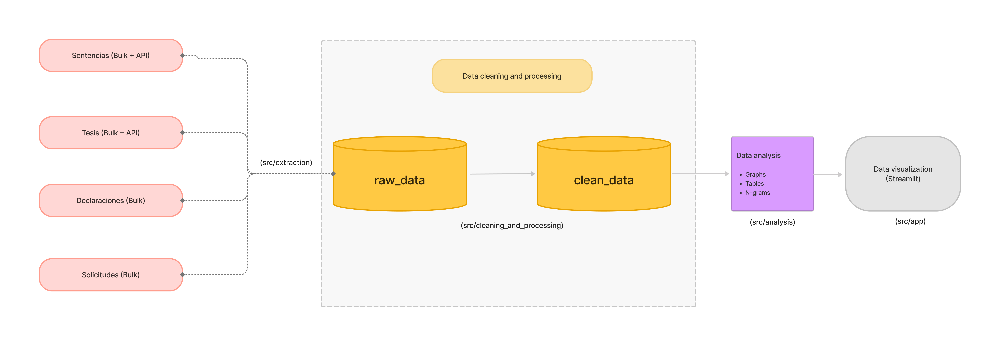

# Accountable Justice Lab 

## Data Sources

All datasources are available in the data folder, except for "Sentencia.csv" and "Tesis.csv", due to their size. The fetch_data element of the Makefile enables the user to fetch the information from a public release from Github. 

### Data Source #1: Sentencias (rulings) and Tesis (precedents)
Person in charge: María Muñoz
Source URL: https://bicentenario.scjn.gob.mx/repositorio-scjn/
Source Type: Bulk + API

Summary: for both sources of information we extracted historical data from a csv file provided by the Supreme Court and the API information for records from August 2025 to date.

The "Sentencias" data source had several inconsistencies in fields within the historical CSV files, particularly in file numbers and missing cells from the "fechaResolucion" (date of ruling) column. To clean this up, we extracted the year contained in the file number to attempt at having more information. We also noticed a gap between information contained in older rulings than new ones. For the API, unlike the tesis API, ruling ids are not progressive and therefore we could not be certain that a higher id meant a more recent ruling. This limited our ability to use the same structure of accessing the API and each of the records. With this, we also noticed that not all of the information provided in the CSV is contained in the fields of the json files in the API. We have already asked the Supreme Court for an update so we can have more homogeneous data. 

Tesis data structure is cleaner but required more processing, mainly because the column "precedents", had relevant information regarding the justice that emitted the tesis and the voting result that had to be extracted through regex. Because the edge cases were identifiable, we decided to address them directly in our code. While we know this is not scalable, for the purposes of this project, this helped us with precision. 

### Data Source #2
Person in charge: Jimena Gómez
Source URL: https://www.plataformadetransparencia.org.mx/datos-abiertos
Source Type: Bulk data 

Summary: The Plataforma Nacional de Transparencia contains information regarding all public entities legally obligated to disclose public information regarding their operation and their staff (including the Supreme Court Justice’s). Within this platform, we can find relevant information such as asset and conflict of interest disclosures, income, curriculum and requests of information made by the public. We believe that this platform can be a valuable addition to our primary source of information, as it will help complement the justice’s profiles. Our primary focus will be the asset and conflict of interest disclosures, although we would also like to analyze requests of information and link those related to the justices so we can also identify what people are asking about them. 

Challenges:
The raw solicitudes files could not be parsed with json.loads() because some records contained broken JSON, especially quotes and commas inside text fields. 
For the future it would be a good idea to design a web scraper for making periodic JSON queries. Because the data was available only from 2016, we downloaded the JSON for each year in the platform directly. 

### Data Source #3
Person in charge: Daniela Avayú
Source URL: https://www.plataformadetransparencia.org.mx/datos-abiertos
Source Type: Bulk data 

Summary: As an additional component, we would like to extract justice’s asset and conflict of interest disclosures. This information will help us build a more robust profile of the justices. Our main aim is to extract information regarding their education, previous professional experience, as well as real estate, property, vehicles and their salaries. 

For the asset disclosure part, the most relevant information is:
Name and lastname
Level of education (all possible)
Institution of education (all possible)
Graduation date (all possible)
Employment level
Job title
Job experience (last five employments)
Salary
Was a public servant last year? (binary variable)
Other income
Vehicle: type, model, brand, cost
Number of investments (we have the investments people own but not the amount)
Liabilities (?)

Challenges:
When we download the information, we get a CSV with independent PDFs per judge. We then have to scrap each PDF.
Each PDF, although has the same overall structure, can be different in number of pages, categories and other components.
There is only information for 2024 and 2025 (up till Q3). We have Q1 2024,Q2 2024, Q3 2024, Q1 2025, Q2 2025, and Q3 2025. We have to combine them and understand if they are initial declarations, regular, or ending declarations.  
Design web scrapping code to extract information from PDF (which we have not done before). Also, not all the PDFs are the same and have similar titles for categories. Salary is in a category different from the other categories. 

## Project structure

All of the process of our project lives in the src directory, which is classified by the main steps taken by the team. Inside each step, there are directories corresponding to each type of data source and the proccesses applied to each one of them, mainly extracting, cleaning and analyzing. 

1. Extraction: extraction of raw data from referred sources. In the case of solicitudes (requests), this process was not necessary because the data was manually extracted from the website.

You can run the extraction module with `make data_extraction`

The extraction step includes a module that automatically extracts all tesis and sentencias data from their corresponding sources of information. This extraction then generates: 
1. Cache directories for API requests. 
2. json and csv files for historical and API information. In the case of historical information, there is a minimal amount of cleaning required in this step, especially in the column renaming (to match API fields), empty rows and columns elimination and updating of relevant values (like file numbers). In the case of tesis, the same process is done, with an additional component of separating tesis emitted by the Supreme Court from other courts in case this csv file is necessary for independent reasons from the app. 

You can run this specific module extraction module with `uv run -m src.extraction`

Declaraciones: 

2. Cleaning and processing: cleaning of raw data and processing information, like adding new fields and extracting relevant information. 

In the case of tesis and sentencias, this process includes joining historical information with information extracted from the API, respectively. In the case of tesis, several functions were applied to extract the voting outcome, justice that emitted the tesis and in extracting the main subject from a list of many. In the case of sentencias, the cleaning and processing part focused on extracting as many dates as possible given the amount of empty fields. 

You can run the extraction module with `make clean_data`. This can also be ran through "uv run -m src.cleaning_and_processing"

3. Analysis: these files contain the functions required to make the charts and tables required for the dashboard. This section includes the functions required for the n-grams analysis, which was used for the solicitudes and tesis data sources.

You can run the analysis module with `make analysis`

4. APP: this module includes the necessary code to run the app and visualize the dashbord, which was programmed in Streamlit. 

You can run the app module with `make app`

## Team responsibilities 

Each team member was responsible for different data sources and their corresponding pipeline. The main files produced by each member are contained in the following directories:
- María Muñoz: sentencias and tesis data sources pipeline (all directories with name "tesis" or "sentencias")
- Jimena Gómez: solicitudes data source pipeline (all directories with name "solicitudes")
- Daniela Avayú: declaraciones data source pipeline (all directories with name "declaraciones")

The app.py file was mostly done by Daniela Avayú and Jimena Gómez.

* the ngrams code was adapted from Jimena's code on ngram analysis for the solicitudes part. 

## Final thoughts 

We were aware this would be a challenging project. Much of the information we sought was not readily available, and substantial data processing was required before meaningful analysis could begin. 

The difficulty stremmed from two main factors. First, given the nature of the data, it required extensive cleaning and processing before it could be used effectively. We also noticed a lot of opportunities in code reutilization that were only possible when looking at the big picture and would have hoped to have enough time to address this element (which we will do so). Secondly, most of the value of this data lies within the text analysis realm.

We were able to extract extremely significant insights from our quantitative and qualitative analyses. For instance, seeing a reduction in activity and in judicial production, which raises several questions: are they not receiving as many cases or are they taking longer to solve them? In the qualitative part, we were able to see the justices that the citizens are more likely to mention and question through requests of information. And, finally, the extraction and analysis of their disclosures shows an opportunity for constant monitoring on justices (and public servants in general) to actively find possible irregularities and negative patterns regarding their wealth. 

We knew from the outset that this project was only a starting point for the potential of these datasources, and we are eager to continue finding new learning opportunities in the use of natural language processing techniques for judicial and public data. 
